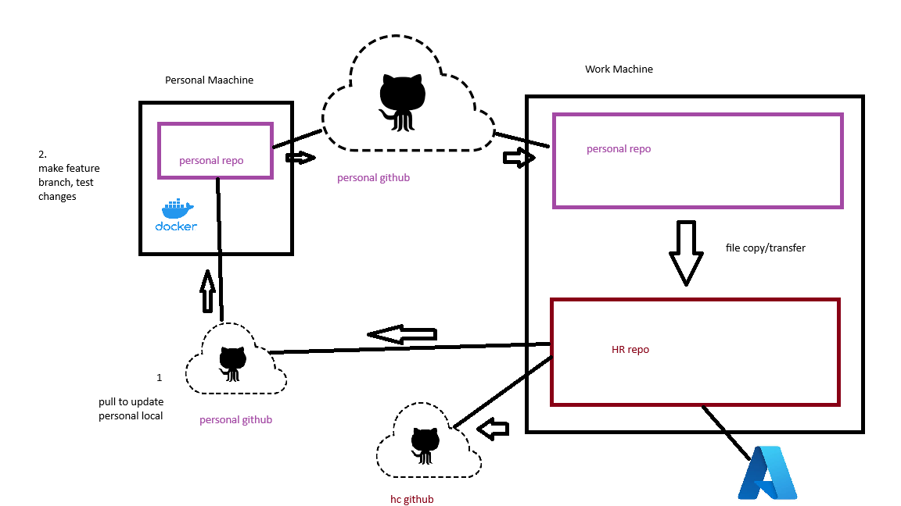

# Development Workflow: Personal → Work → HC-Repo

## Overview
- **Personal machines**: Develop on feature branches in the personal repo
- **Work machines**: Create feature branches in hc-repo, test via GitHub Actions (Azure deployment), create PRs, merge, then sync changes to both HC and personal remotes



---

## Step-by-Step Workflow

### **Phase 1: Development on Personal Machine**

**1. Create a feature branch (never work directly on main)**
```bash
# On personal machine, in personal repo
git checkout main
git pull
git checkout -b feat/your-feature-name
```

**2. Make your changes**
- Edit files, commit as needed
```bash
git add .
git commit -m "Your commit message"
```

**3. Push feature branch to personal GitHub**
```bash
git push
```

---

### **Phase 2: Testing on Work Machine**

**4. Switch to work machine and pull latest from personal repo**
```bash
# On work machine, navigate to personal repo (NOT the hc-repo)
cd /path/to/personal-repo

# Get the latest changes
git fetch
git checkout feat/your-feature-name
git pull
```

**5. Create feature branch in hc-repo and copy code**
```bash
# Navigate to hc-repo on work machine
cd /path/to/hc-repo

# Make sure main is up to date
git checkout main
git pull origin main

# Create a matching feature branch
git checkout -b feat/your-feature-name

# Copy code from personal repo to hc-repo
# Manually copy/paste the changed files from personal repo to hc-repo
# Or use your preferred method to transfer the code

# Stage and commit the changes
git add .
git commit -m "Your commit message"
```

**6. Push feature branch and test via GitHub Actions**
```bash
# Push feature branch to hc-repo
git push feat/your-feature-name
```

- Monitor the deployment and verify everything works correctly

---

### **Phase 3: Create PR, Merge, and Sync**

**7. Create Pull Request**
- Go to HC-GitHub and create a PR from `feat/your-feature-name` to `main`
- Review the changes

**8. Merge the PR**
- Once approved, merge the PR into `main` on HC-GitHub
- This can be done via the GitHub UI

**9. Pull merged code and sync to personal**
```bash
# In hc-repo on work machine
cd /path/to/hc-repo

# Switch to main and pull the latest (merged code)
git checkout main
git pull main

# Sync personal/main with HC/main (keep them in sync)
git push personal origin/main:main
```

This makes `personal/main` match `origin/main` exactly with the latest merged code.

---

## Important Notes

⚠️ **Never mutate `main` from personal machines** — only create feature branches  
⚠️ **Always create a feature branch in hc-repo** before copying code — never commit directly to main  
⚠️ **Test via GitHub Actions** — the feature branch will automatically deploy to Azure for testing  
⚠️ **Use Pull Requests** — always create a PR to merge feature branches into main on HC-GitHub  
⚠️ **Always sync `personal/main` with `origin/main`** after merging PRs — this keeps them in sync  
⚠️ Use `--force-with-lease` when syncing to avoid overwriting unexpected changes

---

## Quick Reference Commands

```bash
# Personal machine - create feature branch
git checkout -b feat/name
git push

# Work machine - pull from personal
cd /path/to/personal-repo
git checkout feat/name
git pull

# Work machine - create feature branch in hc-repo and push
cd /path/to/hc-repo
git checkout main
git pull origin main
git checkout -b feat/name
# Copy code, then:
git add .
git commit -m "Your commit message"
git push origin feat/name
# Create PR, merge, then:
git checkout main
git pull origin main
git push personal origin/main:main --force-with-lease
```

